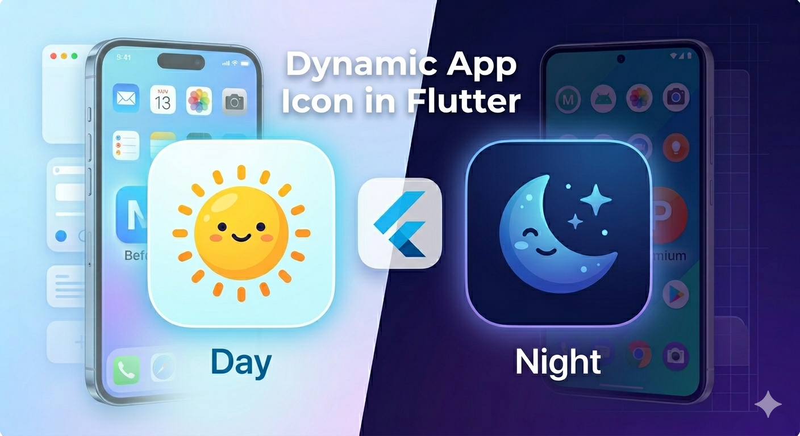
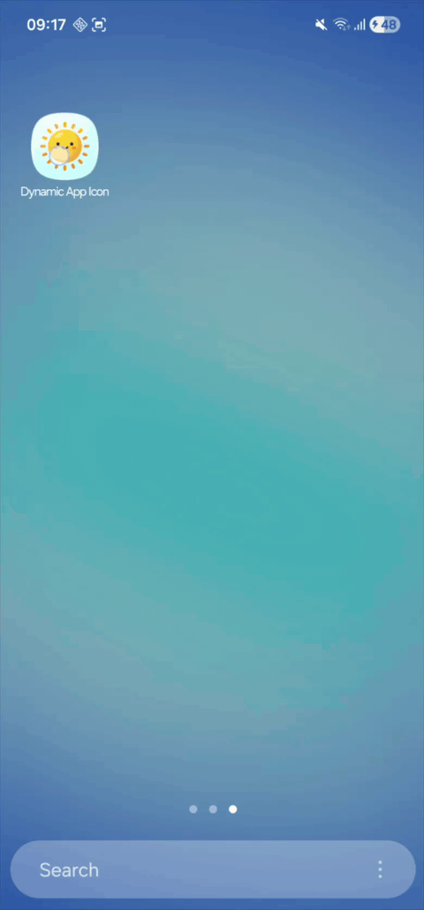
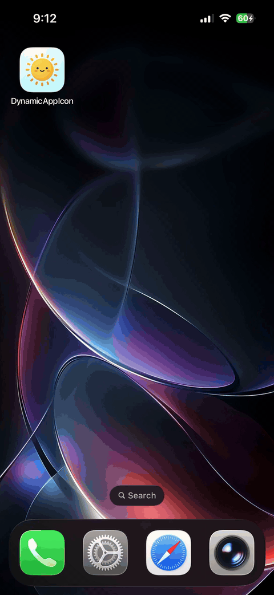

# Dynamic App Icon in Flutter



A sample Flutter app that changes the launcher icon at runtime on **Android** and **iOS** using Platform Method Channels — no third-party packages.

Two icons are included:
- **Day** — bright yellow icon for daytime
- **Night** — dark navy icon for night mode

---

## Demo

### Android



### iOS



---

## Requirements

| Tool | Version |
|---|---|
| Flutter | 3.41.4 |
| Xcode | ≥ 14.0 |
| iOS Deployment Target | 13.0+ |
| Android minSdk | 21 |

---

## Getting Started

```bash
git clone https://github.com/your-username/flutter_dynamic_app_icon.git
cd flutter_dynamic_app_icon
flutter pub get
flutter run
```

> **Android first-run:** If this is a fresh clone or you changed the manifest, do a clean install:
> ```bash
> adb uninstall com.delgendy.com.flutter_dynamic_app_icon && flutter run
> ```

---

## How It Works

### Android
`MainActivity` is disabled in the manifest. Two `<activity-alias>` entries (`.DayIcon`, `.NightIcon`) serve as launcher components. `PackageManager.setComponentEnabledSetting` toggles which one is active.

### iOS
`NightIcon@2x.png` and `NightIcon@3x.png` are bundled as loose resources and declared in `Info.plist` under `CFBundleAlternateIcons`. `UIApplication.shared.setAlternateIconName()` performs the switch.

> iOS always shows a system confirmation dialog when the icon changes — this is an OS requirement and cannot be suppressed.

### Known Limitations
- **Android:** If the Night icon is active and you run `flutter run`, it will fail because `.DayIcon` is disabled. Fix: tap **Day Icon** inside the app first, then re-run.
- **Simulator:** This feature may not work on simulators. Testing on a **real device** is recommended for both Android and iOS.

---

## Project Structure

```
lib/
├── main.dart                          # UI
└── services/dynamic_icon_service.dart # MethodChannel wrapper

android/app/src/main/
├── AndroidManifest.xml                # activity-alias setup
├── kotlin/.../MainActivity.kt         # Native icon switching
└── res/mipmap-*/                      # ic_launcher + ic_launcher_night

ios/Runner/
├── AppDelegate.swift                  # Native icon switching
├── Info.plist                         # CFBundleAlternateIcons
├── NightIcon@2x.png                   # 120×120
├── NightIcon@3x.png                   # 180×180
└── Assets.xcassets/AppIcon.appiconset/

assets/icons/
├── day_icon.png                       # UI preview
└── night_icon.png                     # UI preview
```

---

## References

- [Flutter Platform Channels](https://docs.flutter.dev/platform-integration/platform-channels)
- [Android — PackageManager.setComponentEnabledSetting](https://developer.android.com/reference/android/content/pm/PackageManager#setComponentEnabledSetting(android.content.ComponentName,%20int,%20int))
- [iOS — UIApplication.setAlternateIconName](https://developer.apple.com/documentation/uikit/uiapplication/2806818-setalternateiconname)
